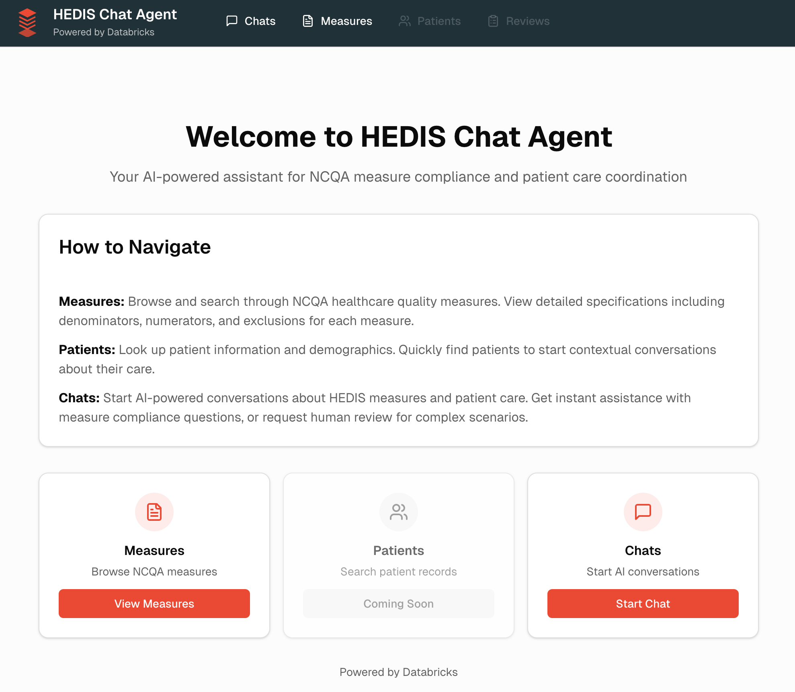

# HEDIS Measure Ingestion Pipeline

## Overview
Data pipeline for ingesting and processing NCQA HEDIS measures with agent-based QnA and compliance evaluation.

## Setup
1. Run `notebooks/setup_infrastructure.py` to create UC catalog, schema, volume, vector search endpoint, and optionally Lakebase
2. Upload your HEDIS measures document to the volume ahead of notebook executions.
3. Run extraction notebooks to process HEDIS PDFs
4. Run agent notebooks to deploy and evaluate

## Features
- **Dual-mode agent**: QnA and Compliance evaluation
- **Automatic intent detection**: Routes to appropriate mode
- **Optional persistence**: Lakebase PostgreSQL checkpointing
- **Evaluation framework**: MLflow-based with 20 test queries

## HEDIS Chat Application

Interactive web application for exploring HEDIS measures and patient data, deployed as Databricks Apps.

### Architecture
- **Frontend**: Next.js application with Tailwind CSS
- **Backend**: FastAPI with CORS-enabled API
- **Deployment**: Dual Databricks Apps (frontend + backend)

### Deploy
Run `notebooks/apps/01_deploy_fastapi_app.py` to deploy both frontend and backend apps to Databricks.

## Requirements
See `requirements.txt`
